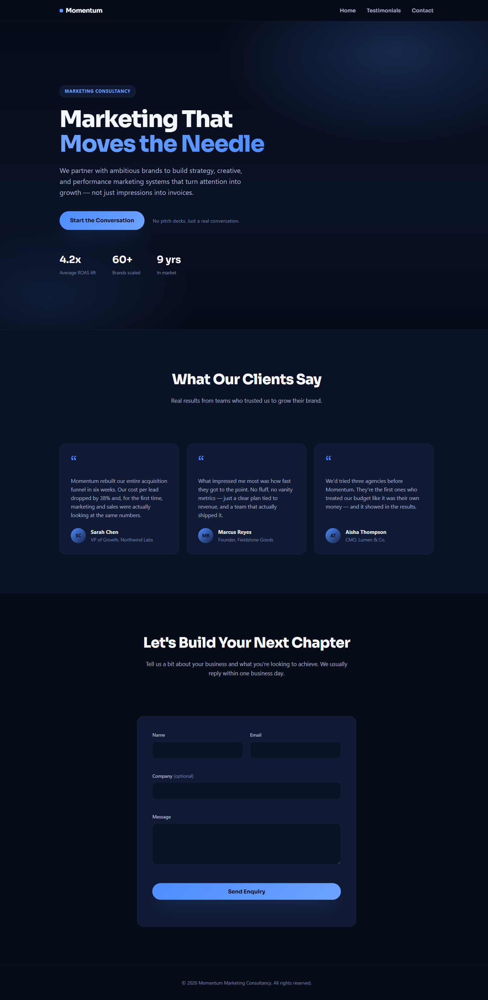

# Momentum — Marketing Consultancy Website

A one-page marketing consultancy website built with plain HTML, CSS, and JavaScript — no frameworks, no build step.

**Live site:** https://kenitas13.github.io/momentum-marketing-site/



## Structure

Everything lives in a single file, [index.html](index.html):

- **Hero** — full-height intro with headline, subheadline, and a CTA that smooth-scrolls to the enquiry form.
- **Testimonials** — a responsive 3-card grid of client quotes.
- **Enquiry form** — Name / Email / Company (optional) / Message, submitted via `fetch()` to [FormSubmit](https://formsubmit.co/).

## Running locally

No build tools or dependencies required — just open the file directly:

```powershell
Start-Process "index.html"
```

## Configuration

The enquiry form posts to a [FormSubmit](https://formsubmit.co/) endpoint defined in the `<script>` block near the bottom of `index.html`:

```js
var FORMSUBMIT_ENDPOINT = 'https://formsubmit.co/ajax/kwswee@gmail.com';
```

No account or form ID needed — FormSubmit routes submissions straight to the email address in the URL. The first submission to a new address triggers a one-time confirmation email that must be clicked before real submissions start delivering.

## Deployment

The site is deployed via GitHub Pages from the `main` branch. Pushing to `main` updates the live site automatically.
